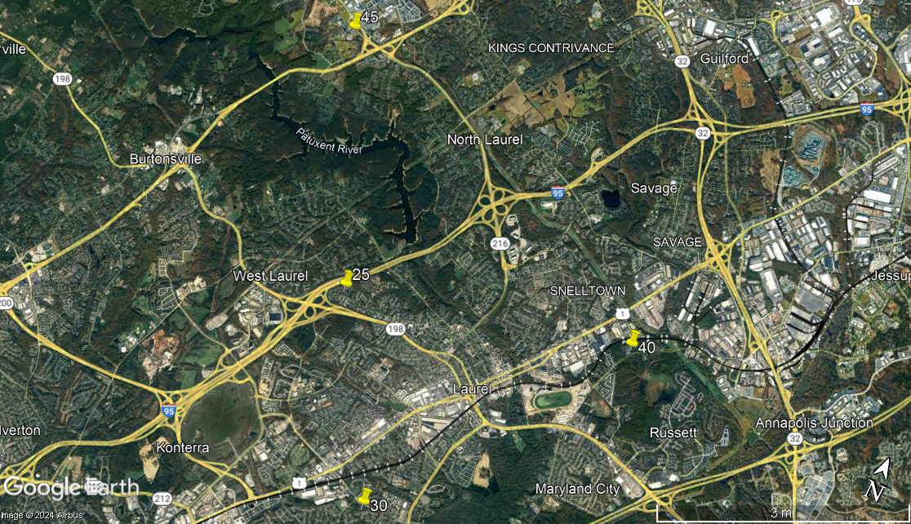

# Address to KML

## General Information
This repository contains a script that takes address and delivery / order information from an Excel spreadsheet and generates a .kml file that can viewed in [Google Earth](https://www.google.com/earth/about/versions/#earth-pro) so that the user can see visually where the addresses are located on a map. This requires Python and the user to have a Google Cloud account. The [Python Google Maps API](https://github.com/googlemaps/google-maps-services-python) retrieves the latitude and longitude coordinates for each address to display the location in Google Earth. Information for setting up a Google Cloud account can be found [here](https://developers.google.com/maps/get-started).

## Back story
This was originally used when my church's high school youth group was selling bags of mulch as a fundraiser. We offered the option of delivery (for an extra fee) and most customers chose to have the bags of mulch delivered to their homes. All the bags of mulch were delivered to the church on a large flatbed trailer and the students' parents (or other parishioners) would take the bags to customers' homes using their vehicles. However, the size of a particular vehicle limited the number of bags that could be delivered in a single trip. I volunteered to make delivery routes to make the delivery process more efficient and organized. When vehicles returned from delivery, I could let them choose a new route from the remaining routes. Then they could simply load-up their vehicle and begin their new delivery route. Sometimes, multiple orders could be delivered in a single trip depending on the size of the order and of the delivery vehicle. Other times, if a house ordered a lot of bags, multiple trips with a smaller vehicle might be necessary. I wanted to eliminate vehicles making multiple trips to the same neighborhood / area, if possible. This script does not plan / make the delivery routes, it is simply for visualization to aid the user in manually creating the delivery routes.

## Usage
    address_to_kml.py [--kml-file KML_FILE] EXCEL_FILE SHEET_NAME N_ROWS_MAX GOOGLE_MAPS_KEY

### Required parameters
1. `EXCEL_FILE` is the name of a Microsoft Excel or .xlsx spreadsheet file
2. `SHEET_NAME` is the name of the sheet (tab) in `EXCEL_FILE` to use
3. `N_ROWS_MAX` is the maximum number of rows in `EXCEL_FILE` to use (counting the column name row)
4. `GOOGLE_MAPS_KEY` is a Google Maps API key (obtained after setting up a Google Cloud account)

### Options
* `--kml-file KML_FILE` is used to specify the name of the generated .kml file. The default name is the name of the spreadsheet file with the .xlsx file extension replaced with .kml.

### Spreadsheet format
`EXCEL_FILE` has the following columns:
1. first name
2. last name
3. address
4. city
5. state
6. zip code (numeric)
7. phone number
8. alternate phone number
9. e-mail address
10. number of bags of mulch ordered
11. delivery? (yes / no)
12. amount paid
13. notes

## Sample
The command: 
`address_to_kml.py sample_orders.xlsx Sheet1 5 <key>` 
was used to generate `sample_orders.kml`. `<key>` is a Google Maps API key. The `sample_orders.xlsx` file contains 4 sample orders. `sample_orders.kml` looks as below when viewed in Google Earth.  